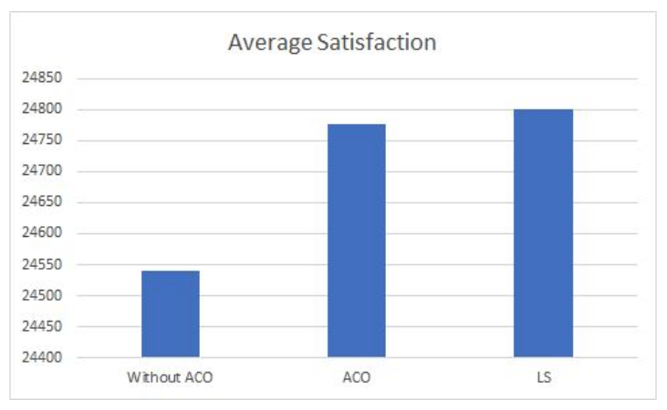

# Doctor-Patient-Matching-using-ACO-with-Local-Search

A mathematical model of the DPCMP(Doctor-Patient Combined Matching Problem) is constructed, and an Improved Ant Colony Optimization Algorithm is designed. Finally, the results were compared with the naive algorithm.

# Results 

 

# Contributors
1. Abhinav Bharali
2. Alimurtaza Merchant
3. Naveen Shenoy
4. Pratham Nayak

